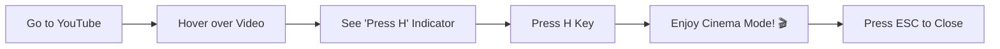

<div align="center">

 

# YouTube Cinema Mode

### 🎬 Watch YouTube Videos in Stunning Cinema-Style Overlay

[](https://chrome.google.com/webstore)
[](LICENSE)
[](https://github.com/simoabid/YT-Cinema-Mode)
[](https://github.com/simoabid/YT-Cinema-Mode)

<p align="center">
  
</p>

**A beautiful Chrome extension that lets you watch any YouTube video in a stunning cinema-style overlay without leaving the current page.**

[🚀 Features](#-features) • [📦 Installation](#-installation) • [🎯 Usage](#-usage) • [⚙️ Settings](#️-settings) • [🤝 Contributing](#-contributing)

---

</div>

## 📋 Table of Contents

- [✨ Features](#-features)
- [📦 Installation](#-installation)
- [🎯 Usage](#-usage)
- [⚙️ Settings](#️-settings)
- [⌨️ Keyboard Shortcuts](#️-keyboard-shortcuts)
- [🛠️ Tech Stack](#️-tech-stack)
- [🔧 Technical Notes](#-technical-notes)
- [🌐 Browser Support](#-browser-support)
- [🤝 Contributing](#-contributing)
- [📝 License](#-license)
- [👨‍💻 Author](#-author)
- [⭐ Show Your Support](#-show-your-support)

## ✨ Features

<table>
<tr>
<td width="50%">

### 🎥 **Hover & Watch**
Simply hover over any video thumbnail and press `H` to open it in cinema mode

### 🎨 **Modern UI**
Sleek, dark-themed overlay with smooth animations

### 🎬 **Full YouTube Player**
Uses the actual YouTube watch page (not embed) for full functionality

### 🖼️ **Picture-in-Picture**
Built-in PiP button for multitasking

</td>
<td width="50%">

### 🔗 **Open in New Tab**
Quick access to open video in a new tab

### ⚙️ **Customizable**
Settings popup to customize hotkey and behavior

### 👁️ **Hover Indicator**
Visual feedback showing which video will open

### ⚡ **Lightning Fast**
Instant loading with optimized performance

</td>
</tr>
</table>

## 📦 Installation

<details open>
<summary><b>📌 Installation Steps</b></summary>

1. **Download or Clone** this repository
   ```bash
   git clone https://github.com/simoabid/YT-Cinema-Mode.git
   ```

2. **Open Chrome** and navigate to `chrome://extensions/`

3. **Enable Developer Mode** (toggle in top-right corner)

4. **Click "Load unpacked"**

5. **Select** the `YouTube-Cinema-Mode-Extension` folder

6. **Done!** 🎉 The extension is now installed

</details>

## 🎯 Usage

<div align="center">



</div>

1. 🌐 Navigate to **YouTube** (youtube.com)
2. 🖱️ **Hover** your mouse over any video thumbnail
3. 👀 You'll see a small **red "Press H" indicator**
4. ⌨️ Press the **`H` key** to open the video in cinema mode
5. ❌ Press **`ESC`** or click outside to close

## ⚙️ Settings

Click the extension icon 🧩 in your toolbar to access settings:

| Setting | Description | Options |
|---------|-------------|---------|
| **🔑 Hotkey** | Change the activation key | H, C, P, or M |
| **🎭 Auto Theater Mode** | Automatically enable theater mode in the player | ON/OFF |
| **👁️ Show Hover Indicator** | Toggle the "Press H" indicator visibility | ON/OFF |

## ⌨️ Keyboard Shortcuts

| Shortcut | Action |
|----------|--------|
| <kbd>H</kbd> | 🎬 Open cinema mode for hovered video |
| <kbd>ESC</kbd> | ❌ Close the overlay |
| <kbd>F</kbd> | ⛶ Toggle fullscreen |
| <kbd>T</kbd> | 🎭 Toggle theater mode inside player |

## 🛠️ Tech Stack

<div align="center">


</div>

**Built with:** Vanilla JavaScript, Chrome Extension Manifest V3, Modern CSS

## 🔧 Technical Notes

- ✅ Uses the full YouTube watch page inside an iframe (not the restricted embed API)
- 🎨 Injects CSS to hide YouTube UI elements and maximize the video player
- 🔒 Sandbox permissions allow scripts while preventing unwanted redirects
- ☁️ Settings are synced across Chrome browsers using `chrome.storage.sync`
- ⚡ Lightweight and optimized for performance
- 🎯 DOM mutation observers for dynamic content detection

## 🌐 Browser Support

<div align="center">

| Browser | Support | Version |
|---------|---------|---------|
|  **Google Chrome** | ✅ Full Support | Latest (Manifest V3) |
|  **Microsoft Edge** | ✅ Full Support | Chromium-based |
|  **Brave** | ✅ Full Support | Chromium-based |
|  **Opera** | ✅ Full Support | Chromium-based |

</div>

## 🤝 Contributing

Contributions, issues, and feature requests are **welcome**! 🎉

<details>
<summary><b>📝 Contribution Guidelines</b></summary>

1. **Fork** the Project
2. **Create** your Feature Branch
   ```bash
   git checkout -b feature/AmazingFeature
   ```
3. **Commit** your Changes
   ```bash
   git commit -m 'Add some AmazingFeature'
   ```
4. **Push** to the Branch
   ```bash
   git push origin feature/AmazingFeature
   ```
5. **Open** a Pull Request

</details>

Feel free to check the [issues page](https://github.com/simoabid/YT-Cinema-Mode/issues) for open issues or to create a new one.

## 📝 License

This project is licensed under the **MIT License** - see the [LICENSE](LICENSE) file for details.

```
MIT License - feel free to use this project for personal or commercial purposes
```

## 👨‍💻 Author

<div align="center">

### **Made with ❤️ and ☕ by [ABID.Dev](https://github.com/simoabid/) 🇲🇦**

[](https://github.com/simoabid)

</div>

## ⭐ Show Your Support

Give a ⭐️ if this project helped you!

<div align="center">

### 🎬 **Happy Watching!** 🍿

[](https://github.com/simoabid/YT-Cinema-Mode)
[](https://github.com/simoabid/YT-Cinema-Mode)

---

**If you found this extension useful, consider giving it a ⭐ on GitHub!**

</div>
