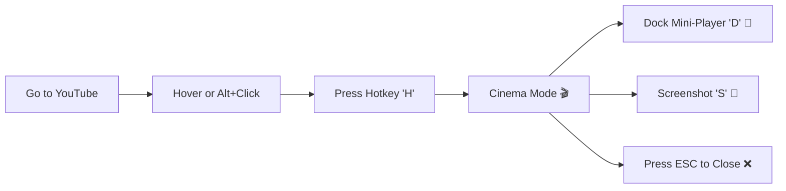

<div align="center">

 

# YouTube Cinema Mode 📽️🎞️

### 🎬 Watch YouTube Videos in a Stunning Cinema-Style Overlay

[](https://chrome.google.com/webstore)
[](https://addons.mozilla.org/)
[](LICENSE)
[](https://github.com/simoabid/YT-Cinema-Mode)
[](https://github.com/simoabid/YT-Cinema-Mode)

<p align="center">
  
</p>

**A beautiful, feature-packed browser extension that lets you watch any YouTube video in a stunning cinema-style overlay without leaving the current page.**

[✨ Features](#-features) • [📦 Installation](#-installation--loading) • [🎯 Usage](#-usage) • [⚙️ Settings](#️-settings) • [⌨️ Shortcuts](#️-keyboard-shortcuts) • [🌐 Browser Support](#-browser-support) • [🤝 Contributing](#-contributing)

---

</div>

## 📋 Table of Contents

- [✨ Features](#-features)
- [📦 Installation & Loading](#-installation--loading)
- [🛠️ Build & Packaging](#️-build--packaging)
- [🎯 Usage](#-usage)
- [⚙️ Settings](#️-settings)
- [⌨️ Keyboard Shortcuts](#️-keyboard-shortcuts)
- [🛠️ Tech Stack](#️-tech-stack)
- [🔧 Technical Architecture](#-technical-architecture)
- [🌐 Browser Support](#-browser-support)
- [🤝 Contributing](#-contributing)
- [📝 License](#-license)
- [👨‍💻 Author](#-author)
- [⭐ Show Your Support](#-show-your-support)

---

## ✨ Features

<table>
<tr>
<td width="50%" valign="top">

### 🎥 **Hover & Watch**
Hover over any video thumbnail and press your configured hotkey (default `H`) or `Alt+H` to immediately open cinema mode.

### 📌 **Draggable & Resizable Mini-Player**
Dock the player into a floating desktop window (`D`). Resize from any edge/corner or corner grip with smooth hardware acceleration. Includes edge snapping and position memory.

### 🪟 **Multiple Floating Videos**
Float multiple videos at once! Dock one video, then hover and pop open more videos. Each player operates independently with smart z-index elevation.

### ✨ **Real-Time Dynamic Ambient Glow**
HTML5 canvas samples video colors in real time to cast reactive ambient lighting (Ambilight). Choose between full-screen aura or player halo, with an intensity slider (20%–100%).

### 📱 **Vertical Shorts Cinema Mode**
Tailored 9:16 smartphone-like frame with auto-looping, camera notch bezel, and mobile dimensions for YouTube Shorts.

### 📸 **High-Res Screenshot Tool**
Capture uncompressed video frames (`S`) with shutter-flash feedback. Use `Shift+S` or `Shift+Click` to copy frames directly to your clipboard!

</td>
<td width="50%" valign="top">

### ⏩ **Speed Controller & Presets**
Speed pill with dropdown menu (`0.25x` to `3x`) and keyboard step controls (`[` / `]`). Optionally persist speed across videos.

### 🕶️ **Backdrop Customizer**
Switch between modern **Frosted Glass** (with 50%–100% opacity slider) and pure **OLED Blackout** mode.

### 🔊 **Glass Volume HUD**
Smooth volume adjustment (`↑` / `↓`) and instant mute/unmute (`M`) with a real-time glass HUD overlay.

### ⏭️ **Playlist & Up Next Navigation**
Skip to the next recommendation/playlist video (`N`) or previous video (`P`) without leaving the overlay.

### 🖱️ **Mouse Triggers & Key Recorder**
`Alt+Click` or middle-click any thumbnail, or bind any keyboard key using the interactive hotkey recorder.

### 🖼️ **Picture-in-Picture & Auto-Pause**
Built-in PiP mode, optional Direct PiP launching, and smart auto-pause/resume for existing tab videos.

</td>
</tr>
</table>

---

## 📦 Installation & Loading

<details open>
<summary><b>📌 Google Chrome / Chromium (Brave, Edge, Opera, Vivaldi)</b></summary>

1. Open Chrome and navigate to `chrome://extensions/`
2. Enable **Developer mode** (toggle in the top-right corner)
3. Click **Load unpacked**
4. Select the extension directory (or `dist/chrome` after running the build script)
5. Done! 🎉 The extension is now active

</details>

<details>
<summary><b>🦊 Mozilla Firefox (Firefox 109+, ESR 115, & 121+)</b></summary>

1. Open Firefox and navigate to `about:debugging#/runtime/this-firefox`
2. Click **Load Temporary Add-on...**
3. Select either:
   - `manifest.firefox.json` in the root folder, or
   - `manifest.json` inside the `dist/firefox` folder (after running `npm run build`)
4. Done! 🎉 Fully functional in Firefox with full API support

</details>

---

## 🛠️ Build & Packaging

The project includes an automated cross-platform build script to package clean releases for both stores:

```bash
# Run build using npm
npm run build

# Or directly with Node.js
node build.js
```

This generates:
- `dist/chrome/` & `dist/youtube-cinema-mode-chrome.zip`: Ready for the **Chrome Web Store** (Manifest V3 service worker).
- `dist/firefox/` & `dist/youtube-cinema-mode-firefox.zip`: Ready for **Firefox Add-ons (AMO)** (Manifest V3 background scripts with Gecko ID).

---

## 🎯 Usage

<div align="center">



</div>

1. 🌐 Navigate to **YouTube** (youtube.com)
2. 🖱️ **Hover** over any video thumbnail (or `Alt + Click` directly)
3. 👀 You'll see a small red **"Press H" indicator**
4. ⌨️ Press your hotkey (default `H`) to open Cinema Mode
5. 🎮 **Control your playback**:
   - Press `D` to dock into a floating mini-player and drag it anywhere
   - Press `S` for screenshot, or `Shift+S` to copy frame to clipboard
   - Press `[` or `]` to adjust playback speed
   - Press `N` or `P` to navigate videos
6. ❌ Press **`ESC`** or click outside the container to close

---

## ⚙️ Settings

Click the extension icon 🧩 in your toolbar to customize features:

| Setting | Description | Default |
|:---|:---|:---:|
| **🔑 Cinema Hotkey** | Interactive recorder to assign any key | `H` |
| **🎨 Backdrop Style** | Choose between Frosted Glass and OLED Blackout | `Frosted Glass` |
| **🌓 Backdrop Opacity** | Adjust background darkness (50% to 100%) | `90%` |
| **✨ Ambient Lighting** | Reactive Ambilight glow matching video colors | `ON` |
| **🌌 Full Screen Glow** | Toggle full-viewport aura vs player container halo | `ON` |
| **💡 Glow Intensity** | Adjust glow intensity and blur spread (20% to 100%) | `75%` |
| **⏸️ Auto-Pause Background** | Automatically pause and resume existing tab videos | `ON` |
| **🕶️ Auto-Hide Controls** | Fade out controls and cursor after 2.5s of inactivity | `OFF` |
| **⏱️ Remember Speed** | Persist chosen playback speed across all videos | `OFF` |
| **📌 Direct Mini-Player** | Open straight into mini-player via `Ctrl + Hotkey` | `ON` |
| **🖼️ Direct PiP** | Open directly in native Picture-in-Picture window | `OFF` |
| **🖱️ Alt + Click Trigger** | Instantly open thumbnail in cinema mode via Alt+Click | `ON` |
| **🖱️ Middle-Click Trigger** | Open thumbnail via middle mouse click | `OFF` |
| **🎭 Auto Theater Mode** | Automatically toggle theater mode in the player | `ON` |
| **👁️ Show Indicator** | Show badge indicator on hovered thumbnails | `ON` |

---

## ⌨️ Keyboard Shortcuts

| Shortcut | Action |
|:---|:---|
| <kbd>H</kbd> *(customizable)* | 🎬 Open cinema mode for hovered video |
| <kbd>Ctrl</kbd> + <kbd>H</kbd> | 📌 Open directly into floating Mini-Player |
| <kbd>Alt</kbd> + <kbd>H</kbd> | 🌐 Global command shortcut to toggle cinema mode |
| <kbd>Alt</kbd> + Click | ⚡ Instant trigger on video thumbnail |
| <kbd>D</kbd> | 📌 Toggle Mini-Player / Corner Dock mode (draggable & resizable) |
| <kbd>S</kbd> | 📸 Capture native-res screenshot (Download PNG) |
| <kbd>Shift</kbd> + <kbd>S</kbd> | 📋 Copy native-res screenshot directly to clipboard |
| <kbd>[</kbd> / <kbd>]</kbd> *(or <kbd><</kbd> / <kbd>></kbd>)* | ⏱️ Decrease / Increase playback speed |
| <kbd>↑</kbd> / <kbd>↓</kbd> | 🔊 Volume up / down (±5% with glass HUD) |
| <kbd>M</kbd> | 🔇 Toggle mute / unmute |
| <kbd>P</kbd> / <kbd>N</kbd> | ⏮️ / ⏭️ Previous / Next video |
| <kbd>Space</kbd> / <kbd>K</kbd> | ⏯️ Play / Pause toggle |
| <kbd>←</kbd> / <kbd>→</kbd> | ⏪ / ⏩ Seek backward / forward (5s / 10s) |
| <kbd>F</kbd> | ⛶ Toggle fullscreen |
| <kbd>T</kbd> | 🎭 Toggle theater mode |
| <kbd>ESC</kbd> | ❌ Close active overlay |

---

## 🛠️ Tech Stack

<div align="center">


</div>

**Built with:** Vanilla JavaScript (ES2022), Cross-Browser Manifest V3, HTML5 Canvas API, and Modern CSS.

---

## 🔧 Technical Architecture

- **Cross-Browser Universal API Bridge**: Unified wrapper dynamically routing between `chrome.*` and `browser.*` APIs.
- **Sandboxed Full YouTube Player**: Embeds the authentic YouTube watch page inside an isolated, script-enabled iframe for full native functionality while preventing unwanted navigation.
- **Hardware-Accelerated Ambient Engine**: Low-overhead HTML5 canvas with `willReadFrequently` optimization that extracts dynamic edge hues to render responsive CSS glow filters.
- **Firefox Xray Vision Security Unwrapping**: Content scripts access `movie_player.wrappedJSObject` to cleanly interface with YouTube playback methods across Firefox boundaries.
- **Dual Manifest Configuration**:
  - `manifest.json`: Universal MV3 with background service worker for Chromium browsers.
  - `manifest.firefox.json`: Firefox MV3 with background scripts and Gecko compatibility.
- **Settings Sync**: Seamless settings synchronization across browser sessions via `storage.sync`.

---

## 🌐 Browser Support

<div align="center">

| Browser | Support | Version |
|:---|:---:|:---|
|  **Google Chrome** | ✅ Full Support | Manifest V3 (Latest) |
|  **Mozilla Firefox** | ✅ Full Support | Firefox 109+, ESR 115+, 121+ |
|  **Microsoft Edge** | ✅ Full Support | Chromium-based |
|  **Brave** | ✅ Full Support | Chromium-based |
|  **Opera** | ✅ Full Support | Chromium-based |

</div>

---

## 🤝 Contributing

Contributions, issues, and feature requests are **welcome**! 🎉

<details>
<summary><b>📝 Contribution Guidelines</b></summary>

1. **Fork** the Project
2. **Create** your Feature Branch
   ```bash
   git checkout -b feature/AmazingFeature
   ```
3. **Commit** your Changes
   ```bash
   git commit -m 'Add some AmazingFeature'
   ```
4. **Push** to the Branch
   ```bash
   git push origin feature/AmazingFeature
   ```
5. **Open** a Pull Request

</details>

Feel free to check the [issues page](https://github.com/simoabid/YT-Cinema-Mode/issues) for open issues or to create a new one.

---

## 📝 License

This project is licensed under the **MIT License** - see the [LICENSE](LICENSE) file for details.

```
MIT License - feel free to use this project for personal or commercial purposes
```

---

## 👨‍💻 Author

<div align="center">

### **Made with ❤️ and ☕ by [ABID.Dev](https://github.com/simoabid/) 🇲🇦**

[](https://github.com/simoabid)

</div>

---

## ⭐ Show Your Support

Give a ⭐️ if this project helped you!

<div align="center">

### 🎬 **Happy Watching!** 🍿

[](https://github.com/simoabid/YT-Cinema-Mode)
[](https://github.com/simoabid/YT-Cinema-Mode)

---

**If you found this extension useful, consider giving it a ⭐ on GitHub!**

</div>
